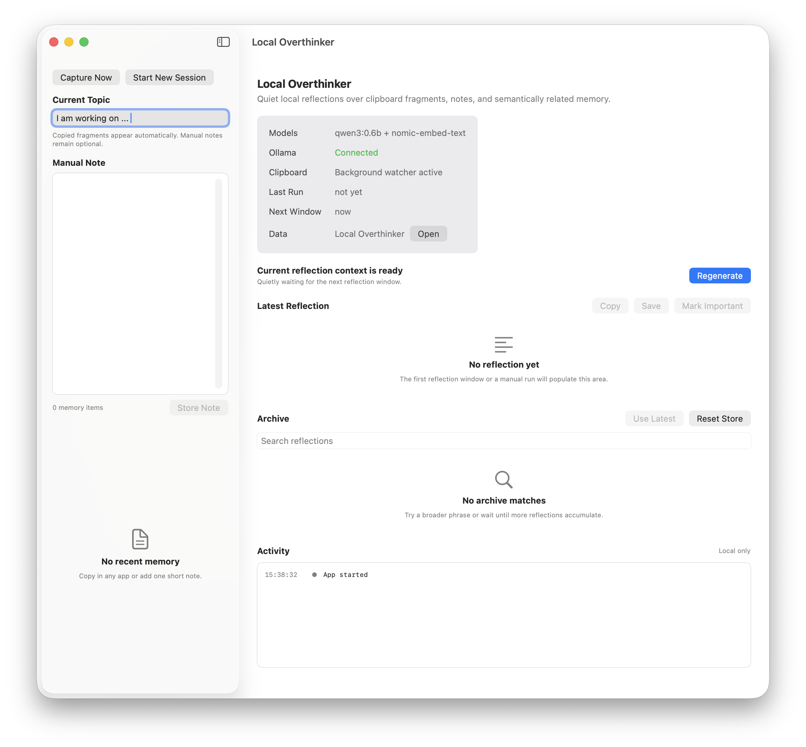
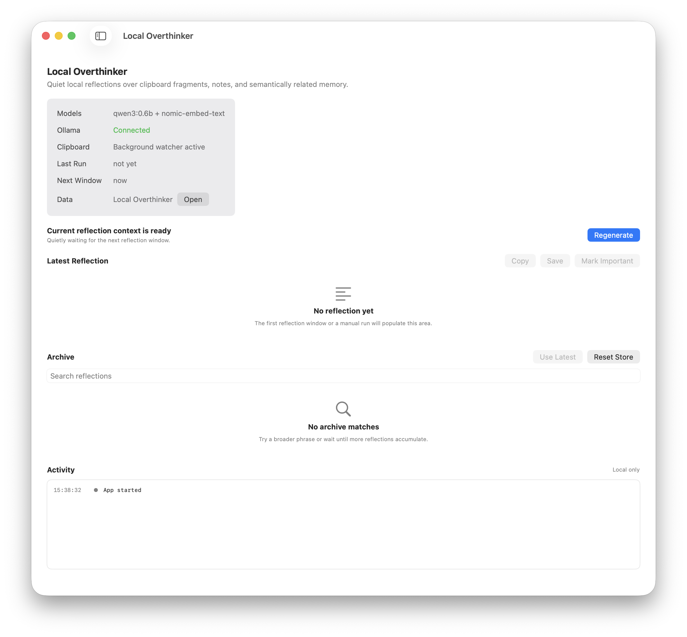

# Local Overthinker

Local Overthinker is a local-first macOS utility for quietly reflecting on what you are copying, collecting, and writing while you work.

It watches the clipboard in the background, stores captured fragments locally, retrieves semantically related older material, and generates structured reflections with a small local Ollama model when there is fresh clipboard activity.

## Screenshots





## What It Does

- Sets one active working topic as the interpretive frame.
- Captures copied text fragments in the background on macOS.
- Accepts optional manual notes without forcing chat-style interaction.
- Generates structured reflections on a timed window or manual rerun.
- Skips idle automatic reflections when nothing new has been copied.
- Retrieves semantically related older artifacts and reflections.
- Stores everything locally in Application Support.
- Exports reflections as Markdown with YAML front matter including generated tags.
- Lets you change local Ollama models and core runtime parameters from the app.

## Native App Structure

The app is now fully native SwiftUI.

- Sidebar:
  topic, clipboard capture, manual notes, recent memory.
- Detail pane:
  model/status settings, reflection run bar, latest reflection, archive, activity log.
- Native services:
  background clipboard polling with `NSPasteboard`, local JSON persistence, direct Ollama HTTP calls.

## Models

Default local models:

- Reflection model: `qwen3:0.6b`
- Embedding model: `nomic-embed-text`

These defaults are persisted in app state and can be changed from the settings panel.

## Requirements

- macOS 13 or newer
- Xcode command line tools / Swift 5.10+
- [Ollama](https://ollama.com/) running locally

Recommended Ollama setup:

```bash
ollama pull qwen3:0.6b
ollama pull nomic-embed-text
ollama serve
```

## Run

```bash
swift run LocalOverthinkerMac
```

## Build

Debug build:

```bash
swift build
```

Release build:

```bash
swift build -c release
```

Package as a macOS app bundle:

```bash
./scripts/build_app.sh
```

The bundle build signs the app automatically when a local signing identity is available.

The release binary will be available at:

```text
.build/release/LocalOverthinkerMac
```

The generated app bundle will be available at:

```text
Build/Local Overthinker.app
```

## Signing

Sign the built app explicitly:

```bash
./scripts/sign_app.sh
```

Behavior:

- Prefers a `Developer ID Application` certificate when available.
- Falls back to a local `Apple Development` certificate for local signing.
- Applies hardened runtime by default.

You can override the identity:

```bash
SIGNING_IDENTITY="Developer ID Application: Your Name (TEAMID)" ./scripts/sign_app.sh
```

## Notarization

Submit the built app for notarization:

```bash
./scripts/notarize_app.sh
```

The script expects one of these credential paths:

- `NOTARYTOOL_PROFILE`
- `APPLE_ID`, `APPLE_TEAM_ID`, and `APPLE_APP_PASSWORD`

Example with a stored profile:

```bash
NOTARYTOOL_PROFILE="local-overthinker-notary" ./scripts/notarize_app.sh
```

## Data Storage

Local data is stored at:

```text
~/Library/Application Support/Local Overthinker/
```

Current persisted state file:

```text
~/Library/Application Support/Local Overthinker/state.json
```

## Repository Layout

```text
Assets/
  AppIconSource.jpg
Sources/LocalOverthinkerMac/
  AppStore.swift
  ContentView.swift
  LocalOverthinkerMacApp.swift
  Models.swift
  OllamaClient.swift
  ReflectionEngine.swift
  AppPaths.swift
Systemprompt.md
docs/screenshots/
```

## Reflection Output

Reflections use the following structure:

- Core Thought
- What Is Emerging
- Hidden Assumptions
- Tensions
- Systemic Reading
- Connection to Long-Term Context
- Next Useful Thoughts
- Reusable Sentence
- Tags

Markdown export writes YAML front matter with:

- `created`
- `topic`
- `tags`

## Current Status

This repository ships the native SwiftUI app source, SwiftPM build configuration, `.app` packaging, local signing, and notarization scripts.

One thing it still does not include is:

- automatic migration from the earlier browser `localStorage` prototype

## License

This repository uses the MIT License. See [LICENSE](LICENSE).
